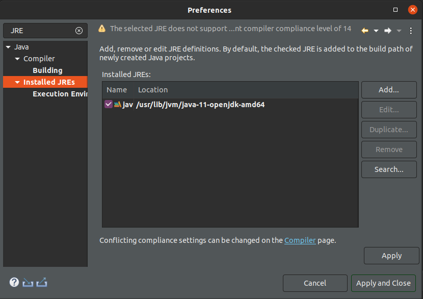

# 00 MONTAGEM DO AMBIENTE

Nesse tutorial irei realizar a instalação do ambiente de desenvolvimento para no **Ubuntu 20.04LTS**

## Intalalação do Java

Para instalar a versão do 11 do java basta digitar no console

    sudo apt install default-jdk

No momento que escrevo a versão default que será instalada será o Java 11 última versão LTS.

Após a instalação para verificar se foi instalado corretamente basta digitar no terminal

    java --version

A resposta deve ser algo do tipo

    openjdk 11.0.8 2020-07-14
    
    OpenJDK Runtime Environment (build 11.0.8+10-post-Ubuntu-0ubuntu120.04)
    
    OpenJDK 64-Bit Server VM (build 11.0.8+10-post-Ubuntu-0ubuntu120.04, mixed mode, sharing)

## Instalação do Spring Tool Suite

A escolha da IDE é algo bastante pessoal. O InteliJ pode ser obtido diretamente da Loja do Ubuntu. No entanto irei utilizar o **Spring Tool Suite**

Para instalá-lo bsta realizar o download de acordo com seu sistema operacional em :

https://spring.io/tools

Uma vez feito o download basta decompactá-lo para que ja esteja funcionando.

### Adicionando o Lombok

Lombok é um projeto que economiza bastante a geração de código boilerplate, ou seja código que sempre tem que ser implementado da mesma forma. Pode realizar o download em:

https://projectlombok.org/

Será feito o download de um jar executável. Clique duas vezes sobre ele e indique o local onde foi colocado o sprint-tool-suite.

Após ele realizar a instalação pode ser necessário conceder a ele a permissão de execução. Para isso navegue até a pasta onde está instalado o spring-tool-suite e execute:

    cd <Home do Spring Tool Suite>
    chmod +x lombok.jar

### Comfigurando o JRE correto no STS

Depois de intalado o Lombok é momento de configurar qual JRE o STS deve utilizar. Para isso clique duas vezes sobre o executável **SpringToolSuite4** indique uma pasta para ser o seu workspace e aguarde ele terminar de inicializar.

Vocẽ irá notar que não é possível adicionar a aplicação na dock do Ubuntu, iremos resolver esse problema na próxima sessão.

Uma vez iniciádo nos menus selecione: Window -> Preferences no formulário aberto, no filtro de texto digite JRE e clique sobre Instaled JREs uma tela assim deve ser exibida:



Por padrão o STS vem configurado para utilizar o JRE 14. Por se apenas o pacote para executar java faltam várias dependências para o desenvolvimento.Dessa maneira precisamos indicar onde instalamos o JDK necessário para o desenvolvimento. Clique em Add e indique o caminho onde está instalado o JDK 11. Na instalação padrão do Ubuntu ele fica em:

    /usr/lib/jvm/java-1.11.0-openjdk-amd64

Caso não consiga encontrá-lo abra um terminal e digite:

    update-java-alternatives --list

Esse comando irá listar todos os ambientes java instalados e os caminhos onde estão instalados no meu caso:

    java-1.11.0-openjdk-amd64      1111       /usr/lib/jvm/java-1.11.0-openjdk-amd64

Eu geralmente removo as JREs deixando apenas os JDKs que necessito.

### Adicionando o Spring Tool Suite a dock do Ubuntu

Para conseguir adicionar o STS a dock do Ubuntu será necessário criar manualmente o atalho. Para isso no terminal digite

    gedit sts.desktop

Isso irá abrir o editor do gedit no arquivo cole os seguintes comandos:

    [Desktop Entry]
    Type=Application
    Name=STS
    Comment=Spring Tool Suite
    Icon=<home do sts>/icon.xpm
    Exec=<home do sts>/SpringToolSuite4
    Terminal=false
    Categories=Development;IDE;Java;
    StartupWMClass=Spring Tool Suite 4

Salve o arquivo. No terminal também dê permissão de execução ao arquivo

    chmod +x sts.desktop

Execute o arquivo você irá observar que o atalho irá apresentar corretamente o ícone e o Spring ira abrir mas, novamente ainda não será possível adicioná-lo a dock. Após executar o arquivo uma vez mova o para ~/.local/share/applications com o comando:

    mv sts.desktop ~/.local/share/applications

Agora clicando no botão super digite STS quando o atalho for exibido clique com o botão direito do mouse sobre ele e selecione adicionar a favoritos. Pronto agora ele ficará na dock.

## Instalação do Maven

Maven é uma ferramenta de gerenciamento de pacotes e de build. Para instalá-la é necessário realizar o download de:

http://maven.apache.org/download.cgi

Após o download descompacte a pasta para onde deseja instalá-la. No meu caso eu deixei na /home e ainda renomeei a pasta adicionando um "." ao início. Dessa maneira a pasta ficará oculta.

Depois disso no terminal digite o comando 

    gedit ~/.bashrc

E adicione as seguintes linhas ao final do arquivo

```sh
export MAVEN_HOME=/home/tiago/.apache-maven-3.6.3
export PATH=$PATH:$MAVEN_HOME/bin
```

## Instalação do Insomnia

O Insomnia é uma aplicação que torna possível realizar testes em nossa API Rest.

VOcê pdoe fazer o download daqui:

https://insomnia.rest/download/

Ou no caso do Ubuntu obtẽ-lo diretamente da Loja Snap