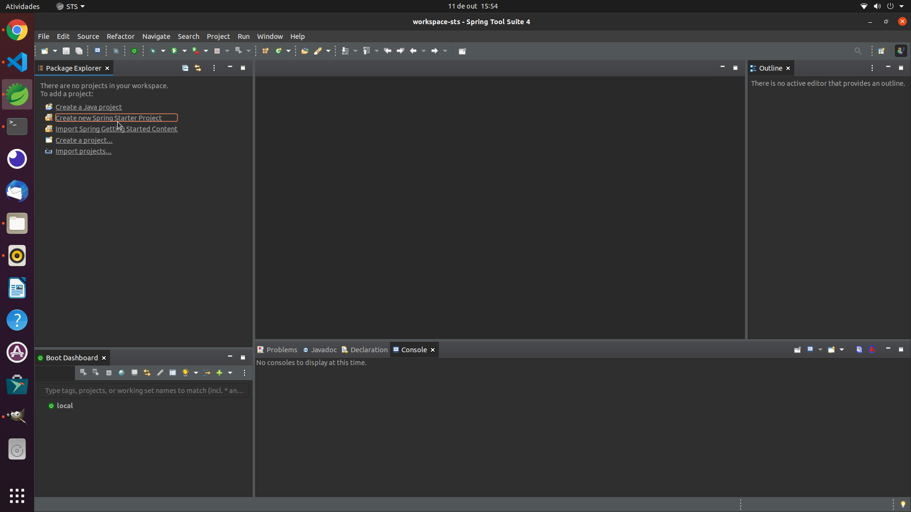
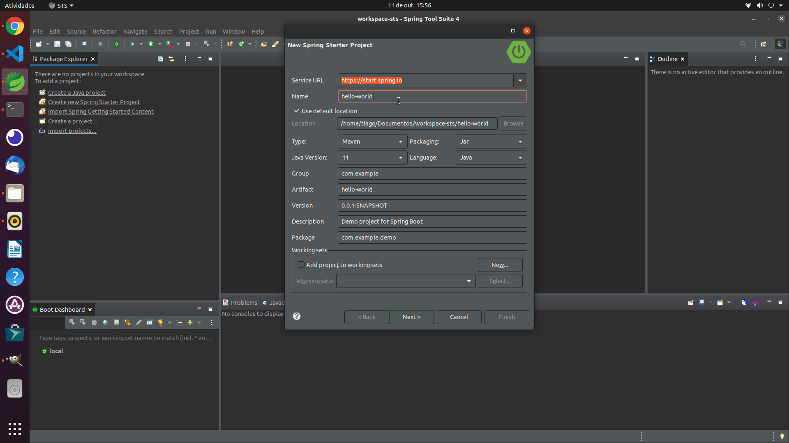
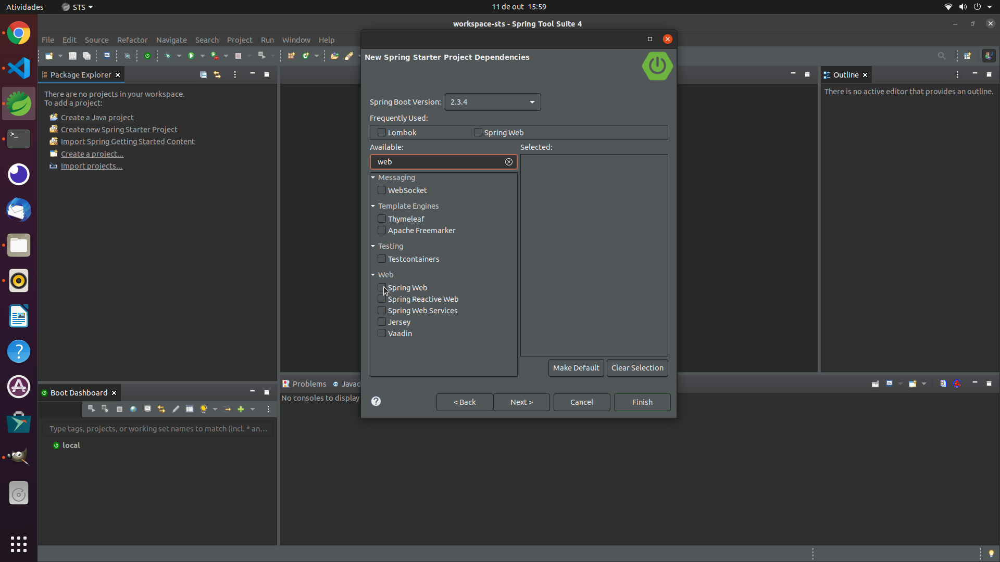
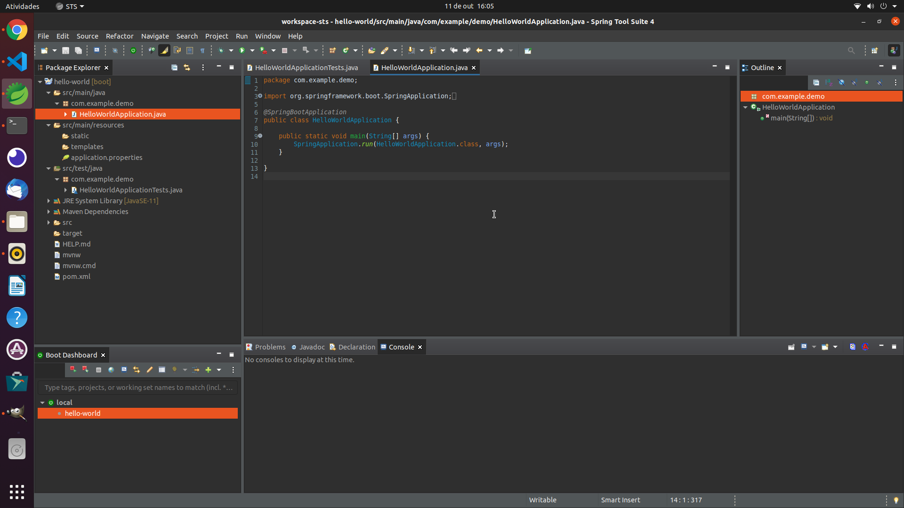
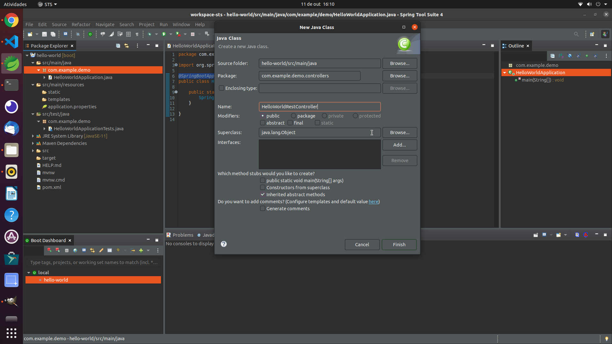
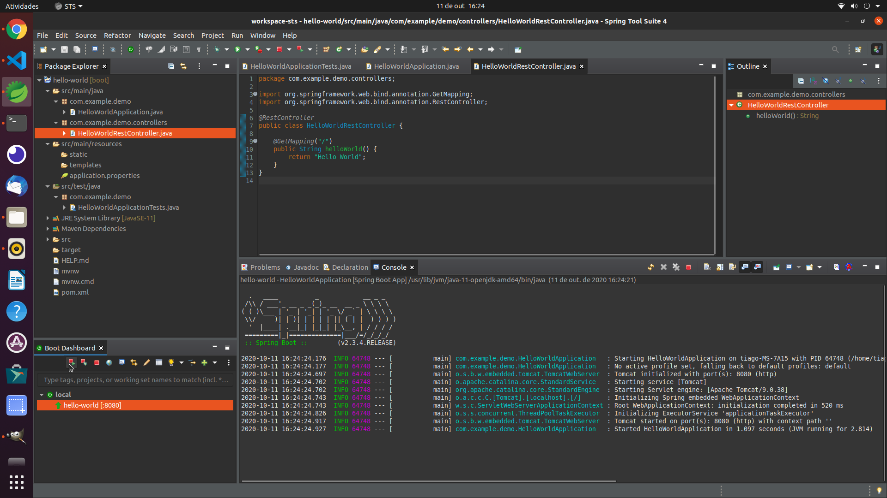
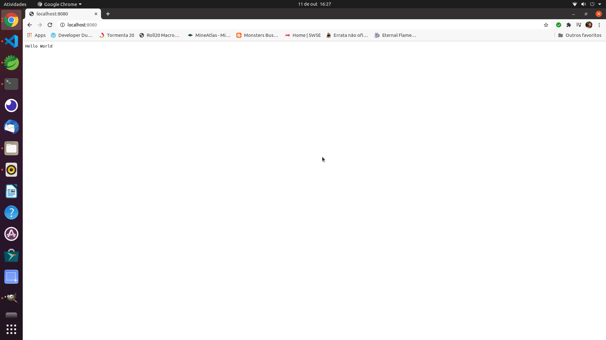

# HELLO WORLD

Vamos começar com um clássico um sistema simples que responde Hello World ao você requisitá-lo no browser.

Para começar depois de iniciar o Spring Tool Suite (STS)  selecione Create new Spring Starter Project



Coloque o nome do artefato de hello-world e clique em next



Adicione somente o pacote Spring Web e clique em Finish



Aguarde a criação do projeto. Depois de criado ele terá a seguinte estrutura



A classe mais importante é a HelloWorldApplication ela define o ponto de execução inicial da aplicação e a notação @SpringBootApplication se encarrega de configrruar boa parte do framework. Por enquanto a configuração inicial já nos é suficiente.

Vamos criar o controller, que é a classe responsável por mapear as rotas e disponibilizar conteúdo em uma aplicação rest.

Clique com o direito no pacote com.example.demo, selecione criar classe. Na janela de criação de classe adicione ao nome do pacote .controllers e chame a classe de HelloWorldRestController, clique em Finish.



Depois de criada a classe defina a seguinte estrutura

``` java
@RestController
public class HelloWorldRestController {
	
	@GetMapping("/")
	public String helloWorld() {
		return "Hello World";
	}
}
```
A anotação `@RestController` informa ao Spring que ele deve criar uma instância da classe e disponibilizá-la no contexto. Além disso ela também informa ao Spring que se trata de um controller, ou seja, uma classe que fará parte da interface da aplicação. Além disso, também informa que o Spring não deve tentar renderizar uma página a partir do retorno do controller e sim retornar o dado diretamente.

A anotação `@GetMapping` é usada para definir uma rota. Nesse caso a rota responde ao método get do protocolo http, no endereço "/", ou seja, a raiz da aplicação.

Tudo certo basta selecionar a aplicação hello-world no canto inferior esquerdo do STS e selecionar start. Pelo console você vai conseguir acompanhar a inicialização da aplicação. Aguarde o término da inicialização.



Depois de iniciada abra uma janela do seu browser e digite na url

    http://localhost:8080/

Será exibida a seguinte mensagem:



Parabens! sua primeira aplicação Spring-Boot está pronta. Para empacotar a aplicação e poder serví-la fora do STS abra uma janela do terminal. Navegue até a pasta root do projeto e digite o seguinte comando:

    mvn clean package

Aguarde o termino do processo de build. Depois utiliz o seguinte comando:

    java -jar target/hello-world-0.0.1-SNAPSHOT.jar

Navegue novamente no browser para a url  `http://localhost:8080/` e você verá a mesma mensagem exibida anteriomente.

## Referências

https://spring.io/guides/gs/spring-boot/