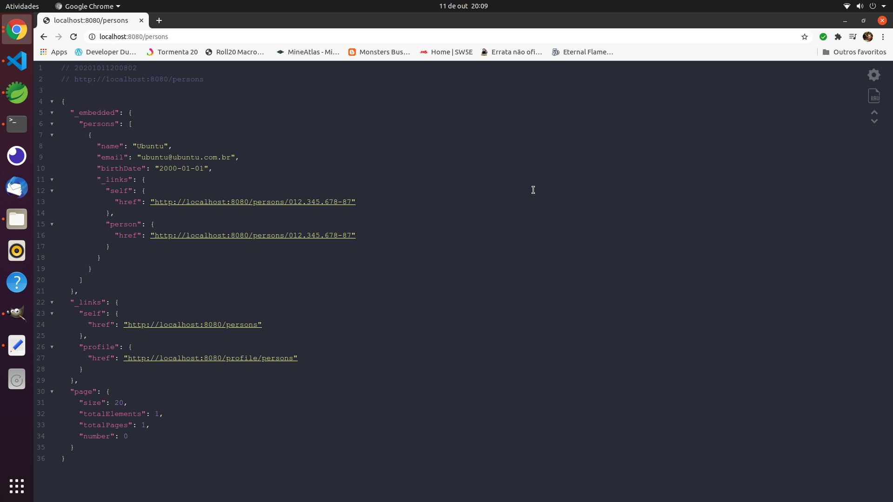

# WEBCARROS

Bom vamos começar a desenvolver nossa aplicação, para automatizar o sistema de vendas de uma concessionária.

Podemos destacar então duas entidades básicas, os automóveis que serão vendidos, e os clientes que comprarão os carros. Da análise de negócio do projeto recebemos a seguinte história:

---
**SENDO** Um atendente

**QUERO** Cadastrar um cliente com: Nome, CPF, email, data de nascimento

**PARA QUE** Possa ofertar promoções e estabelecer comuicação direta com nosso clientes

---

Já temos o primeiro passo para a nossa aplicação.

Para começar clique com o botão direito no Package Explorer do STS selecione New -> Spring Starter Project.

Vamos definir como o nome da nossa aplicação `web-carros` e para o group `com.web-carros` e clique em next.


Iremos adicionar os seguintes pacotes:

    Lombok (Para geração de código boilerplate)
    Spring Data JPA (Para realização das tarefas de persistência)
    H2 Database (Base de Dados em memória para testes)
    Spring Web (Pacote básico para criação de aplicações REST)
    Rest Repositories(Expor rapidamente a API para operações com entidades - será removido posteriormente)
    Validation (Validações na entidade)
    Developer Tools (Para reinicializações rápidas durante o desenvolvimento)


Aguarde enquanto é realizado o download dos pacotes necessários.

Bom vamos criar nossa classe que mapeia a entidade. Para evitar colisões com outras classes dentro da stack do java iremos chamar nossa classe de person.

Clique com o direito sobre o pacote da raiz do projeto e selecione criar uma classe. Vamos definir o pacote `com.webcarros.domain.entities` para abrigar todas as entirades de nosso banco de dados. Crie uma classe chamada Person com a seguinte estrutura:

```java
@Data
@NoArgsConstructor
@AllArgsConstructor
@Entity
public class Person {
	
	@Id
	private String cpf;
	
	@NotNull(message = "Name cannot be null")
	private String name;
	
	@Email
	@NotNull(message = "Email cannot be null")
	private String email;	
	
	private LocalDate birthDate;

}
```

Diversas novidades aqui.

* `@Data` : Anotação do Lombok, gera todo o boilerplate de getters e setters para a classe;
* `@NoArgsConstructor` : Implementa o construtor sem nehum atributo;
* `@AllArgsConstructor` : Implementa o construtor com todos os atributos;
* `@Entity` : Informa ao framework que a classe se trata de uma entidade, ou seja, mapeia uma tabela do banco de dados.
* `@Id` : Sinaliza o campo que mapeia a chave primária da tabela.
* `@NotNull`: : Indica que um valor igual a null não é aceito no campo para realizar a persistência
* `@Email` : Verifica se o email está bem formatado antes de ser persistido.

Para que consigamos realizar algum teste vamos implementar um RestRepository afim de oferecer operações básicas com a entidade.

Clique novamente com o botão direito no pacote raiz, selecione New -> Interface indique o pacote `com.webcarros.domain.repositories` crie a interface `PersonRestRepository` com o seguinte conteúdo:

```java
@RepositoryRestResource
public interface PersonRestRepository extends JpaRepository<Person, String> {
}
```

A anotação `@RepositoryRestResource` informa que a interface exporta um recurso e o Spring deve gerar a api para externa o recurso.  A interface `JpaRepository` define métodos que depois são injetados pelo próprio framework para realizar as operações básicas de persistência: listagem, inserção, atualização, remoção.

Por fim, vamos adicionar algumas pessoas para que possamos listá-las:

Para isso vamos modificar a classe `WebCarrosApplication` para que ela execute um comando tão logo a aplicação inicalize. Modifique a classe para que ela fique da seguinte forma:

```java
@SpringBootApplication
@Slf4j
public class WebCarrosApplication {

	public static void main(final String[] args) {
		SpringApplication.run(WebCarrosApplication.class, args);
	}
	
	@Bean
	CommandLineRunner initDatabase(final PersonRestRepository repository){
		return args -> {
			log.info("Saving... " + repository.save(new Person("012.345.678-87", "Ubuntu", "ubuntu@ubuntu.com.br", LocalDate.parse("2000-01-01"))));
		};		
	}
}
```

Pronto! Novamente clique em inicializar a aplicação na esquerda embaixo no STS. Acesse a url

    http://localhost:8080/persons

Você verá uma saída parecida com essa:



Caso queira adicionar um novo usuário utilizando o **Insomnia** envie um post para 

    http://localhost:8080/persons

Com um conteúdo do tipo:

```json
{
    "name": "CentOS",
    "email": "centos@centos.com.br",
    "birthDate": "2000-01-01",
	"cpf" : "98765432123"
}
```

Envie e você terá uma resposta do tipo:


Nosso sistema já lista e salva alguns usuários mas, estamos aceitando CPF com caracteres, não estamos verificando o formato dele. As letras maiúsculas e minúsculas nos nomes podem tornar a pesquisa no banco lenta. Então precisamos de uma classe de serviço para lidar com isso. Mas isso fica para a próxima etapa.