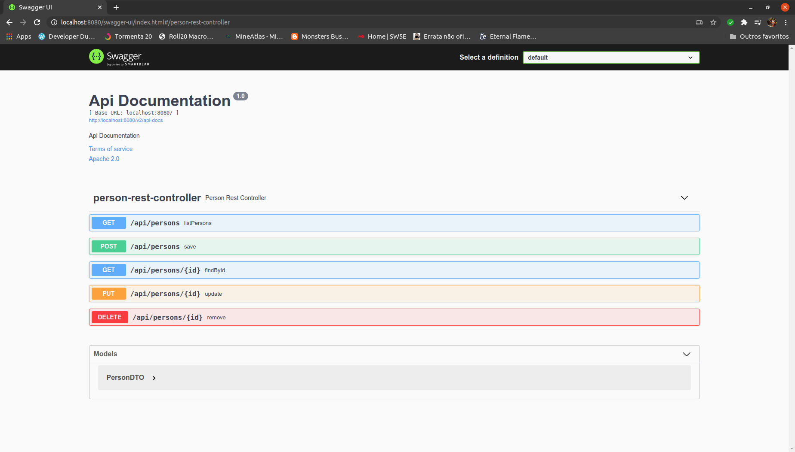

# TERMINANDO E DOCUMENTANDO A API

Depois de incluir as rotas de pesquisa e inserção de usuários restam as rotas de: seleção, remoção e atualização.

Como seria bastante repetitivo a implementação das rotas deixo abaixo somente o teste e a implementação de cada.

Teste seleção:
```java
@Test
public void testFindUserById() throws  Exception {
    
    //Arrange
    final PersonDTO personDTO = this.builPersonDTO();
    final Person person = buildPerson(personDTO);
    when(personService.findByCPF(any())).thenReturn(person);
    
    //Act
    this.mockMvc.perform(get("/api/persons/12345678901"))
        //Assert
        .andExpect(status().isOk())
        .andExpect(content().json(objectMapper.writeValueAsString(personDTO)))
        .andDo(print());
}
```

Implementação da seleção:
```java
@GetMapping("/{id}")
public PersonDTO findById(@PathVariable final String id) {
    final Person person = personService.findByCPF(id);
    return toDTO(person);
}
```

Teste da remoção:
```java
@Test
public void testDeleteUserById() throws Exception {
    
    doNothing().when(personService).remove(any());
    
    this.mockMvc.perform(delete("/api/persons/12345678901"))
        .andExpect(status().isOk());
}
```

Implementação da remoção:
```java
@DeleteMapping("/{id}")
public void remove(@PathVariable final String id) {
    personService.remove(id);
}
```

Teste da atualização:
```java
@Test
public void testUpdateUser() throws Exception {
    
    final PersonDTO personDTO = this.builPersonDTO();
    
    when(personService.update(any(String.class), any(Person.class))).thenAnswer(i -> i.getArgument(1));
    
    this.mockMvc.perform(put("/api/persons/123456789017")
            .content(objectMapper.writeValueAsString(personDTO))
            .contentType(MediaType.APPLICATION_JSON)
            .characterEncoding("utf-8"))
            //Assert
            .andExpect(status().isOk())
            .andExpect(content().json(objectMapper.writeValueAsString(personDTO)))
            .andDo(print());
    
}
```

Implementação da atualização:
```java
@PutMapping(value = "/{id}", consumes = MediaType.APPLICATION_JSON_VALUE)
public PersonDTO update(@PathVariable final String id, @RequestBody final PersonDTO dto) {
    final Person person = this.toEntity(dto);
    final Person update = personService.update(id, person);
    return this.toDTO(update);
}
```

## Documentando a API

Para documentarmos de maneira automática a API iremos utilizar o swagger mais exatamente o projeto springfox que integra ele com o spring-boot.

Para isso no nosso `pom` iremos adicionar a dependência do projeto:

```xml
<dependency>
    <groupId>io.springfox</groupId>
    <artifactId>springfox-boot-starter</artifactId>
    <version>3.0.0</version>
</dependency>
```
Para fazermos a configuração do swagger vamos criar a classe `SwaggerConfiguration` no pacote `com.webcarros.config` e inserir a seguinte configuração:

```java
@Configuration
public class SwaggerConfiguration {

	@Bean
	public Docket api() {
		return new Docket(DocumentationType.SWAGGER_2)
				.select()
				.apis(RequestHandlerSelectors.basePackage("com.webcarros"))
				.paths(PathSelectors.ant("/**"))
				.build();
	}
}
```

E colocando a aplicação para rodar e acessando a url
```
http://localhost:8080/swagger-ui/index.html#/person-rest-controller
```

Vemos a tela do swagger onde podemos fazer testes com a nossa API!

